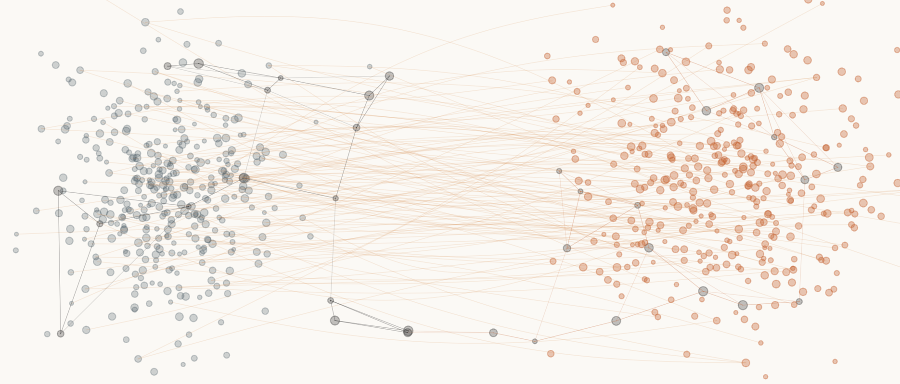
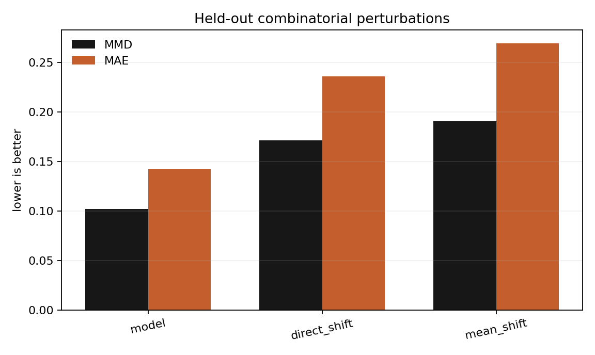
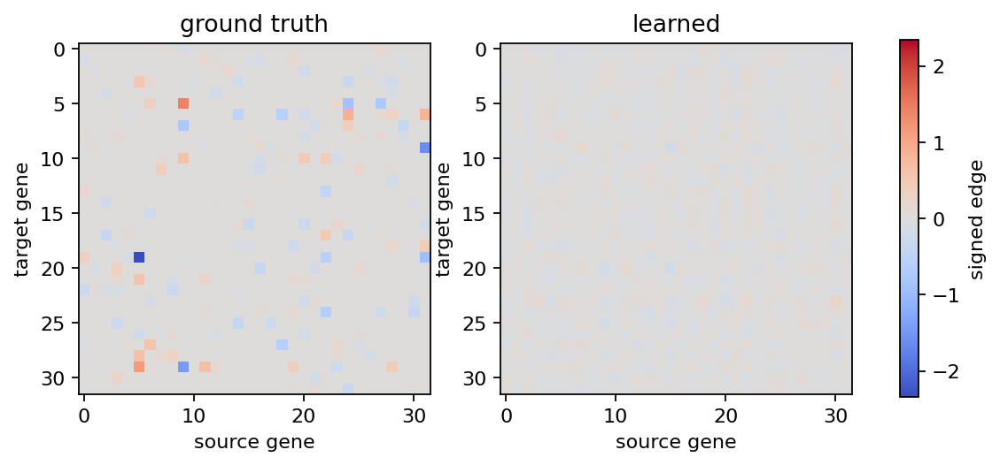

# Counterfactual Cell World

Counterfactual Cell World is a research implementation for predicting how a cell population changes after a perturbation that was not seen during training. The first benchmark is synthetic by design: it gives us ground truth gene programs, known interventions, and enough control to check whether the model learned counterfactual structure or only memorized labels.

The project is organized as a small lab repo:

- a controllable single-cell perturbation simulator
- a PyTorch model for distribution-level counterfactual prediction
- training and evaluation scripts
- figures and a short technical note
- tests for the math and data contracts

This is not meant to look finished by hiding the hard parts. The point is to make the assumptions visible, make the failure modes measurable, and keep the code clean enough to extend toward real Perturb-seq data.

## Quick Start

```bash
uv sync
uv run python scripts/run_synthetic.py --config configs/synthetic_small.yaml
uv run python scripts/make_figures.py --run-dir runs/synthetic_small
uv run pytest
```

## What The Model Tries To Learn

Given a source cell state distribution, a perturbation, a dose, and a time point, the model predicts the target post-intervention distribution. It does this with three parts:

1. a learned sparse gene interaction map
2. a continuous latent transition model conditioned on interventions
3. a probabilistic decoder trained with likelihood and distribution matching losses

The synthetic benchmark exposes held-out combinatorial perturbations, so a model that only memorizes single knockouts should fail.



## Benchmark Snapshot

The checked run in `results/synthetic_small` hides intervention combinations during training. On the held-out split, the model beats both direct-shift and mean-shift baselines on MSE, MAE, MMD, energy distance, and mean gene correlation.





## Current Status

The repo starts with the synthetic world because it is the fastest way to test the algorithm honestly. Real dataset adapters are kept separate so the core modeling code can be judged before dataset wrangling takes over.
